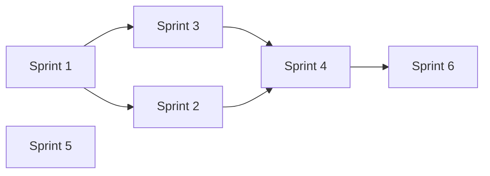

# Sprint Overview

6 sprint, mỗi sprint ~2 tuần (ước lượng). Làm tuần tự trừ khi ghi chú dependency khác.

## Bảng tổng quan

| Sprint | Theme | Effort | Schema mới | Blocker |
|--------|-------|--------|------------|---------|
| [01](./sprint-01.md) | Quick wins — Saved, feed, social state | ~3–5 ngày | Không | — |
| [02](./sprint-02.md) | Reader UX — Related, Share, TOC, SEO | ~4–6 ngày | Không | — |
| [03](./sprint-03.md) | Engagement — Follow, Notify, View dedup | ~8–12 ngày | Có | Sprint 1 (optional) |
| [04](./sprint-04.md) | Discovery — Trending, Search, Dashboard | ~6–10 ngày | Có (PostView agg) | Sprint 3 (view dedup) |
| [05](./sprint-05.md) | Writer — Series, Schedule, Revisions | ~10–14 ngày | Có | — |
| [06](./sprint-06.md) | Scale & trust — FTS, Moderation | ~8–12 ngày | Có | Sprint 4 search baseline |

## Dependency graph

Sprint 5 (writer tools) **độc lập** — có thể song song Sprint 3–4 nếu 2 người dev.

## Trạng thái

| Sprint | Status | Ghi chú |
|--------|--------|---------|
| 01 | `done` ✅ | Saved, PostFeed, like/bookmark state |
| 02 | `done` ✅ | Related, Share, TOC, SEO/RSS/sitemap |
| 03 | `planned` | |
| 04 | `planned` | |
| 05 | `planned` | |
| 06 | `planned` | |

> Cập nhật cột Status khi bắt đầu/hoàn thành sprint.
